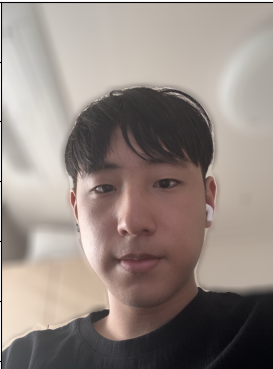
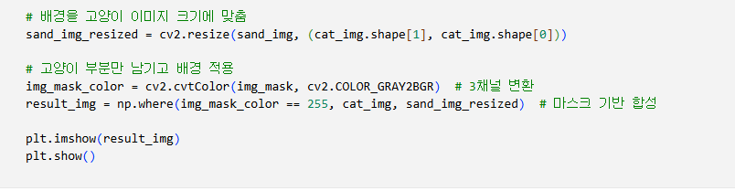
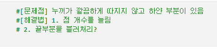

# AIFFEL Campus Online Code Peer Review Templete

- 코더 : 안선모
- 리뷰어 : 이상진
# PRT(Peer Review Template)

- [v] **1. 주어진 문제를 해결하는 완성된 코드가 제출되었나요?**
      
- [v] **2. 전체 코드에서 가장 핵심적이거나 가장 복잡하고 이해하기 어려운 부분에 작성된
      주석 또는 doc string을 보고 해당 코드가 잘 이해되었나요?** 
    
- [v] **3. 에러가 난 부분을 디버깅하여 문제를 해결한 기록을 남겼거나
      새로운 시도 또는 추가 실험을 수행해봤나요?** 

- [v] **4. 회고를 잘 작성했나요?**
    
- [v] **5. 코드가 간결하고 효율적인가요?**


# 회고(참고 링크 및 코드 개선)

```
요구하는 실험을 모두 수행하였음 
```
